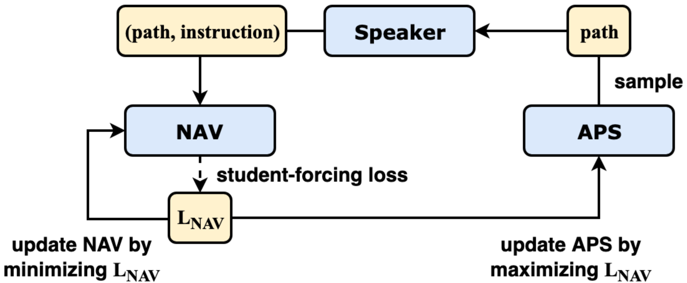

# [ECCV'20 (Spotlight)] Counterfactual Vision-and-Language Navigation via Adversarial Path Sampler
Models of APS

[Paper](https://tsujuifu.github.io/pubs/eccv20_aps.pdf) | [Slide](https://tsujuifu.github.io/slides/eccv20_aps.pdf) | [Video](https://youtu.be/eCPtNWDe2RQ)



## Notice
Since the code is too messy (several settings for different architectures), we currently provide the trained models for further experiments. 
The architectures of [R2R](https://github.com/peteanderson80/Matterport3DSimulator) and [Speaker-Follower](https://github.com/ronghanghu/speaker_follower) are the same as original, so you can apply the code and load the model directly. We have verified that the performance is the same as our report in the paper.

## Usage
Please apply code in [R2R](https://github.com/peteanderson80/Matterport3DSimulator) and [Speaker-Follower](https://github.com/ronghanghu/speaker_follower) to load the model
+ [APS-trained Model](https://drive.google.com/drive/folders/1dV_KHTFNt7Qs1CpxUe3JK2LY7ZuFG05D?usp=sharing)

## Citation
```
@inproceedings{fu2020aps, 
  author = {Tsu-Jui Fu and Xin Eric Wang and Matthew Peterson and Scott Grafton and Miguel Eckstein and William Yang Wang}, 
  title = {Counterfactual Vision-and-Language Navigation via Adversarial Path Sampler}, 
  booktitle = {European Conference on Computer Vision (ECCV)}, 
  year = {2020} 
}
```
